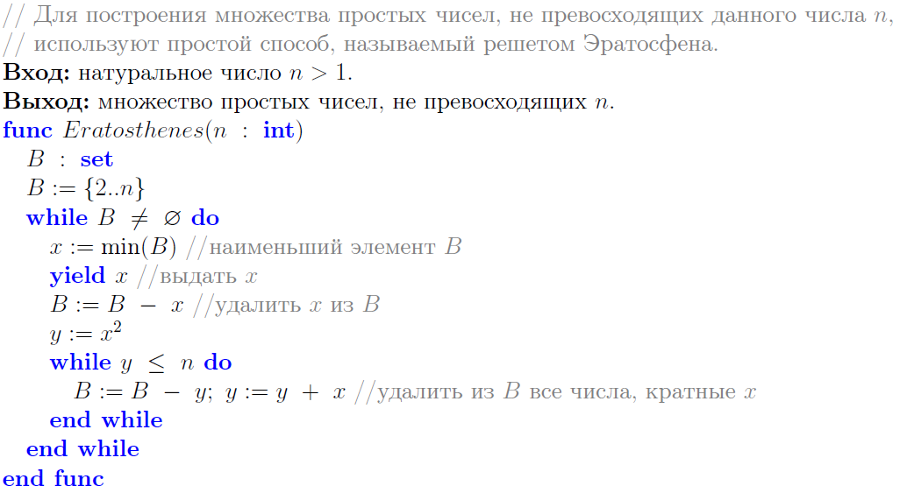

# MAPY

DSL для перевода псевдокода в LaTeX и Python.
ФАН: Титульный лист должен содержать авторов, дату и статус документа 

## Содержание

<!---toc start-->

* [MAPY](#mapy)
  * [Содержание](#cодержание)
  * [Что полезного делает DSL во внешнем мире?](#что-полезного-делает-dsl-во-внешнем-мире)
  * [Как называется DSL?](#как-называется-dsl)
  * [Инструментарий](#инструментарий)
  * [Результаты](#результаты)
    * [Обход графа в ширину](#обход-графа-в-ширину)
    * [Обход графа в глубину](#обход-графа-в-глубину)
    * [Решето Эратосфена](#решето-эратосфена)
  * [Получение кода](#получение-кода)
  * [Установка зависимостей](#установка-зависимостей)
  * [Компиляция грамматики](#компиляция-грамматики)
    * [Подготовка для работы с ANTLR](#подготовка-для-работы-с-antlr)
    * [Получение файлов грамматики в виде Python файлов](#получение-файлов-грамматики-в-виде-python-файлов)
  * [Запуск трансляции](#запуск-трансляции)

<!---toc end-->

## Что полезного делает DSL во внешнем мире?


ФАН: на самом деле варианты использования симметричны и равноправны, и в том и в другом случае из псевдокода получается код, который может быть исполнен. Только это разные языки кодирования: LaTeX - Python и разные результаты выполнения. Советую один абстрактный вариант использования Воплощение псевдокода и от него наследуются два конкретных варианта: Генерация ТеХа и Генерация Питона.
## Как называется DSL?


## Инструментарий 

Для описания грамматики и для обходов AST деревьев использовалась библиотека `ANTLR v4`. Грамматика находится в файле [MAPY.g4](MAPY.g4). Визиторы для трансляции в LaTeX и Python находятся в файлах [LaTeX_emitter.py](LaTeX_emitter.py) и [Python_emitter.py](Python_emitter.py) соответственно.

ФАН: Я что-то сделал неправильно, повторяю комментарий. Грамматика отличная, её можно усилить либо метамоделью псевдокода, причём в метамодели классы называются также, как нетерминалы в грамматике, либо прямым комментированием некоторых правил грамматики. 
ФАН: Генераторы выходного кода как визиторы - это очень хорошо. Мне понятно, почему питоновский генератор вдвое длиннее теховского - потому что меняется синтаксическая структура. Мне не совсем понятно, зачем в латеховском генератора hard coded функция split_string. Некоторое количество комментариев могло бы помочь. 


## Результаты

### Обход графа в ширину

- MAPY

```mapy
// Обход графа в ширину
Вход: граф Г(V, E), представленный списками смежности G.
Выход: последовательность вершин обхода.
func BFS(G : array [1..p] of set)
    T : queue
    V : set
    x : array [1..|G|] of 0..1
    V := {1..|G|}
    for v \in V do x[v] := 0 end for //вначале все вершины не отмечены
    select v \in V //начало обхода — произвольная вершина
    v \to T //помещаем v в структуру данных T...
    x[v] := 1 //... и отмечаем вершину v
    repeat
        u \gets T //извлекаем вершину из структуры данных T...
        yield u //... и возвращаем её в качестве очередной пройденной
        for w \in G[u] do
            if x[w] = 0 then
                w \to T //помещаем w в структуру данных T...
                x[w] := 1 //... и отмечаем вершину w
            end if
        end for
    until T = \varnothing
end func
```

- LaTeX


- Python

```python
import random


def select(it):
    x = random.sample(it, 1)[0]
    it.remove(x)
    return x


class queue:
    arr: list

    def __init__(self):
        self.arr = []

    def enqueue(self, x):
        self.arr.append(x)

    def dequeue(self):
        return self.arr.pop(0)

    def empty(self):
        return len(self.arr) == 0

    def clear(self):
        return self.arr.clear()


#  Обход графа в ширину
# Вход: граф Г(V, E), представленный списками смежности G.
# Выход: последовательность вершин обхода.
def BFS(G: list):
    T = queue() 
    V = set() 
    x = [None for _ in range(len(G) - 1 + 1)] 
    V = set(range(1, len(G) + 1)) 
    for v in V: x[v - 1] = 0  # вначале все вершины не отмечены
    v = select(V) # начало обхода — произвольная вершина
    T.enqueue(v) # помещаем v в структуру данных T...
    x[v - 1] = 1 # ... и отмечаем вершину v
    while True: 
        u = T.dequeue() # извлекаем вершину из структуры данных T...
        yield u # ... и возвращаем её в качестве очередной пройденной
        for w in G[u - 1]: 
            if x[w - 1] == 0: 
                T.enqueue(w) # помещаем w в структуру данных T...
                x[w - 1] = 1 # ... и отмечаем вершину w
        if T.empty(): break
```

### Обход графа в глубину

- MAPY

```mapy
// Обход графа в глубину
Вход: граф Г(V, E), представленный списками смежности G.
Выход: последовательность вершин обхода.
func DFS(G : array [1..p] of set)
    T : stack
    V : set
    x : array [1..|G|] of 0..1
    V := {1..|G|}
    for v \in V do x[v] := 0 end for //вначале все вершины не отмечены
    select v \in V //начало обхода — произвольная вершина
    v \to T //помещаем v в структуру данных T...
    x[v] := 1 //... и отмечаем вершину v
    repeat
        u \gets T //извлекаем вершину из структуры данных T...
        yield u //... и возвращаем её в качестве очередной пройденной
        for w \in G[u] do
            if x[w] = 0 then
                w \to T //помещаем w в структуру данных T...
                x[w] := 1 //... и отмечаем вершину w
            end if
        end for
    until T = \varnothing
end func
```

- LaTeX


- Python

```python
import random


def select(it):
    x = random.sample(it, 1)[0]
    it.remove(x)
    return x


class stack:
    arr: list

    def __init__(self):
        self.arr = []

    def push(self, x):
        self.arr.append(x)

    def pop(self):
        return self.arr.pop()

    def top(self):
        return self.arr[-1]

    def empty(self):
        return len(self.arr) == 0

    def clear(self):
        return self.arr.clear()


#  Обход графа в глубину
# Вход: граф Г(V, E), представленный списками смежности G.
# Выход: последовательность вершин обхода.
def DFS(G: list):
    T = stack() 
    V = set() 
    x = [None for _ in range(len(G) - 1 + 1)] 
    V = set(range(1, len(G) + 1)) 
    for v in V: x[v - 1] = 0  # вначале все вершины не отмечены
    v = select(V) # начало обхода — произвольная вершина
    T.push(v) # помещаем v в структуру данных T...
    x[v - 1] = 1 # ... и отмечаем вершину v
    while True: 
        u = T.pop() # извлекаем вершину из структуры данных T...
        yield u # ... и возвращаем её в качестве очередной пройденной
        for w in G[u - 1]: 
            if x[w - 1] == 0: 
                T.push(w) # помещаем w в структуру данных T...
                x[w - 1] = 1 # ... и отмечаем вершину w
        if T.empty(): break
```

ФАН: более чем убедительно! Особенно меня тронуло вот это место: G : array [1..p] of set и x : array [1..|G|] of 0..1. Вопрос о рекурсивных определениях типов выходит за рамки DSL, я согласен. Определение G : array [1..|G|] of set повергнет читающего в ступор вместо прояснения ситуации.  

### Решето Эратосфена

- MAPY

```mapy
// Для построения множества простых чисел, не превосходящих данного числа n,
// используют простой способ, называемый решетом Эратосфена.
Вход: натуральное число n > 1.
Выход: множество простых чисел, не превосходящих n.
func Eratosthenes(n : int)
    B : set
    B := {2..n}
    while B \neq \varnothing do
        x := min(B) //наименьший элемент B
        yield x //выдать x
        B := B - x //удалить x из B
        y := x ^ 2
        while y \leq n do
            B := B - y; y := y + x //удалить из B все числа, кратные x
        end while
    end while
end func
```

- LaTeX



- Python

```python
#  Для построения множества простых чисел, не превосходящих данного числа n,
#  используют простой способ, называемый решетом Эратосфена.
# Вход: натуральное число n > 1.
# Выход: множество простых чисел, не превосходящих n.
def Eratosthenes(n: int):
    B = set() 
    B = set(range(2, n + 1)) 
    while bool(B): 
        x = min(B) # наименьший элемент B
        yield x # выдать x
        B = B.difference({x}) # удалить x из B
        y = x ** 2 
        while y <= n: 
            B = B.difference({y}); y = y + x # удалить из B все числа, кратные x
```

ФАН 12:21 26 апр 2020: Далее отчёт, видимо, еще не закончен, но план отчёта понятен. Общая оценка превосходно, т.е. 5+. Я хочу принять этот DSL на вооружение и за лето переделать алгоритмы в своих лекциях, а также насытить среду в лабораторных на Питоне. Сам псевдокод также следует изменить в сторону Питона и сокращения кода. Для этого мне понадобится на первом этапе попыток практического применения инструмента некоторый help desk. Поможете? Также я уверен, что журнал "Компьютерные инструменты в образовании" с удовольствием примет статью на эту тему. 

## Получение кода
```cmd
git clone https://github.com/...
```

## Установка зависимостей
Нужно установить все зависимости:
```cmd
pip install -r requirements.txt
```

## Компиляция грамматики

### Подготовка для работы с ANTLR
- Windows  

  ```cmd
  antlr4env.bat
  ```
  
- PyCharm IDE
  
  1. Установить плагин `ANTLR v4 grammar plugin`
  2. Настроить параметры компиляции грамматики:
     * ПКМ по файлу `MAPY.g4` и нажать на `Configure ANTLR...`
     * В поле `Output directory where all output is generated` прописать дерикторию с проектом
     * В поле `Language` прописать `Python3`
     * Поставить галочку `generate parse tree visitor`
     * Нажать `OK`

### Получение файлов грамматики в виде Python файлов
- Windows  
  
  ```cmd
  antlr4py3 MAPY.g4
  ```
  
- PyCharm IDE

  ПКМ по файлу `MAPY.g4` и нажать на `Generate ANTLR Recognizer`  

## Запуск трансляции

- Перевод MAPY в LaTeX
  
    Выполнить команду
    
    ```cmd
    python mapy2latex.py [-h] -i INPUT_MAPY [-o OUTPUT_LATEX]
    ```
  
    * `-i`, `--input_mapy` - путь к файлу с кодом на языке MAPY, который нужно транслировать в LaTeX
    * `-o`, `--output_latex` - путь к файлу, в который запишется результат трансляции в LaTeX. По умолчанию `out.tex`

- Перевод MAPY в Python
  
    Выполнить команду
    
    ```cmd
    python mapy2py.py [-h] -i INPUT_MAPY [-o OUTPUT_PY]
    ```
  
    * `-i`, `--input_mapy` - путь к файлу с кодом на языке MAPY, который нужно транслировать в Python
    * `-o`, `--output_py` - путь к файлу, в который запишется результат трансляции в Python. По умолчанию `out.py`
