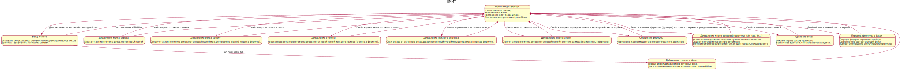
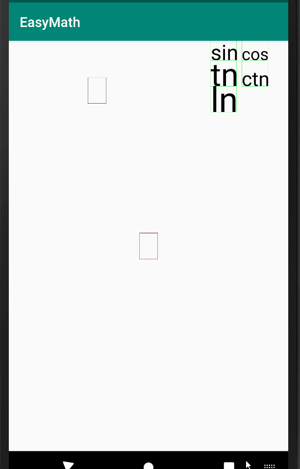
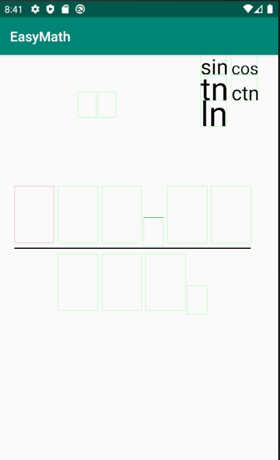
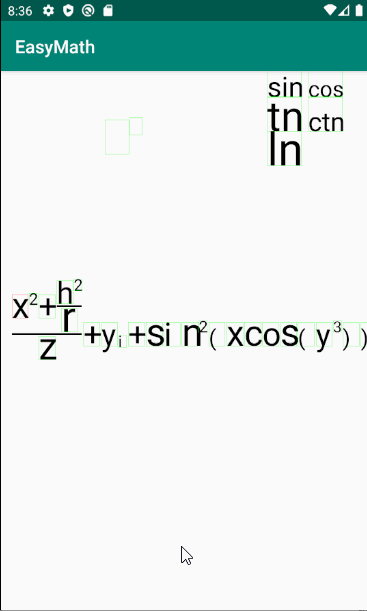

# Титульный лист
- EMMT - приложение для ввода формул на смартфоне (о.с. Android) и перевода их в LaTeX формат
- Выполнили: Федоров Дмитрий, Павел Лебедь
- Дата обновления: 26.04.2020

# Реализация
### Токен
Формула в программе представлена как древовидная структура данных, каждый узел которой может быть связан с другими узлами. Узел называется token'ом и является основой для построения формулы. Если смотреть со стороны пользователя, то token - это один символ/знак в формуле. Токен представляет собой прямоугольник (бокс) с границей на экране, в котором может быть не более одного символа. 
### Связи между токенами
Каждый токен связан с соседнеми:
- right - (правый) ссылка на соседний правый в одном ряду
- right_up - (верхний справа) степень в формуле
- right_down - (нижний справа) нижный индекс в формуде
- up - (верхний) верхний индекс в формуле
- down - (нижний) нижний индекс в формуде
- denominator_start - ссылка на первый токен знаменателя. Каждый токен может содержать несколько таких связей. Владелец такой ссылки является началом числителя
- numerator - ссылка на последний токен числителя. Используется для того, чтобы распозновать конец дроби. Владелец такой ссылки является концом знаменателя.

### Ввод формулы пользователем
#### Диаграмма состояний ввода формул пользователем

#### Добавление пустых токенов
Пользователь делает свайп, который начинается в токене (прямоугольнике связаным с ним), и заканчивается снаружи токена. В зависимости от угла наклона свайпа, его длины, создаются различные пустые токены, связанные с данным.

#### Ввод линейного текста
Для ввода текста пользователь зажимает любой токен. Откроется диалоговое окно для ввода текста. весь введенный текст интерпретируется как множество "право-связанных" токенов. Первый символ текста помещается в активный токен. Для остальных: каждый символ будет новым токеном.

#### Ввод групп токенов
Для манипуляции с многосимвольными объектами как с единым целым, существует возможность создавать токены как единые группы. 
Для этого в правой верхней части экрана есть меню, в котором существуют различные группы токенов: мы так называем, различные функции (например: sin, cos, atan, и т.п). При перетаскивании их в токен, создается группа токенов, в центре которой пустой бокс. В LaTeX их синтаксис таков: \имя_группы{аргумент}. Когда пользователь создает связь от любого токена этой группы, то связь добавляется всей группе (так например если создать токен знаменателя, свайпая от буквы s в группе sin, то черта деления появится под sin(...), а не под одной s).

#### Удаление токена
Для удаления токена или группы токенов, нужно сделать свайп влево от любого бокса.

### Перемещение формулы по экрану
Свайп вне формулы перетаскивает формулу по экрану. Свайп в правой стороне экрана вверх или низ - изменяет масштаб формулы.

# Экспорт в LaTeX
Пользователь может сделать двойной клик снизу экрана.
Будет произведен экспорт текущей формклы в формат Latex, сохранение ее в файл, а также формула выведется во всплывающее окно.

# Идеи для улучшения
- Изменить интерфейс на более "приятный"
- Добавить возможность экспорта формул (не всех) из строчки в формате LaTeX, для их послежующего изменения.
- Доработать расположение токенов при построение формулы (сейчас не учитываются нижнии и верхние токены)
- Добавить сложные знаки (сумма интеграл).
