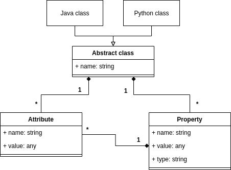

# `ClassDesc`
Предметно-ориентированный язык (DSL) для описания классов с возможностью задания различных атрибутов и автогенерацией исходных файлов этих классов на разных языках программирования (`Java` и `Python`).
### Авторы:
* Павел Денисов @Ppasha9 (pavelvan50@gmail.com)
* Туников Дмитрий @DmitriiTunikov (dima.tunikov@mail.ru)
### Статус документа
Итоговый отчет о реализованном проекте. Разработка окончена.
### Дата
27/04/2020

# Практическая применимость

## Пошаговое описание использования проекта
1. Пользователь описывает свой класс на языке ClassDesc(пример приведен ниже)
2. Запускает генератор классов со следующими параметрами:  
    * Файл с написанным классом  
    * Список языков, в которые необходимо конвертировать данный класс  
3. После генерации пользователь получит набор файлов для каждого из переданных ЯП. Каждый файл будет содержать код класса на конкретном ЯП. Теперь пользователь может добавить полученные классы к себе в проекты.  

## Применимость
Довольно часто разные части одного приложения написаны на разных языках, при этом структуры данных, с помощью которых эти части общаются - одинаковые. Например, клиент и сервер, которые общаются по http очень часто используют одинаковые структуры данных.  
То есть, наш DSL можно будет использовать для быстрой генерации исходного кода классов на определенном языке программирования, чтобы потом использовать его в своих целях.

Также, по автоматически сгенерированному коду, новичкам в программировании можно будет посмотреть как правильно/желательно реализовывать разные структуры на разных ЯП.

# Метамодель языка  
  

В данном реализации мы поддержали только возможность задания примитивных типов для полей класса. В случае таких языков, как `Java`, `Python`, `C++` и т.д., включая все современные языки, примитивные типы всегда копируются, и не ссылаются на существующие вне класса объекты. Таким образом, после удаления самого класса его поля тоже очищаются, поэтому это между полями и классом отношение композиции.  
Атрибут в нашем случае просто указывает на то, что данный класс или поле поддерживает какие-либо операции, например, его можно сохранить в формате `JSON`. Сам по себе атрибут не уничтожится после уничтожения класса. Каждый атрибут по сути статичен и существует набор атрибутов, которые хранятся вне зависимости от класса. Поэтому при уничтожении класса атрибуты не уничтожатся, следовательно между ними существует отношение агрегации.  

# Что было сделано

## Общий процесс работы
1. Парсинг файла с описанием класса, написанный на нашем DSL - файл с расширением `*.dsc`.
    * Был реализован свой парсер на основе регулярных выражений, так как приложение Александры Орищенко слишком долго шло до общественности.
    * Данный парсер на выходе выдает структуру абстрактного класса, которая содержит в себе всю необходимую информацию о свойствах и атрибутах самого класса.
2. Загрузка шаблонов, написанных на языке JINJA2, для кодогенерации.
3. Заполнение шаблонов данными из абстрактного класса. 
4. Рендеринг шаблонов в выходные файлы.

## Реализованные атрибуты

### Классовые атрибуты 
1. `[json_serializable]` - атрибут, добавляющий к классу методы сохранения экземпляра класса в формате `JSON`.
2. `[json_deserializable]` - атрибут, добавляющий к классу методы загрузки значений переменных экземпляра класса из формата `JSON`.
3. `[category=<category_name>]` - атрибут, добавляющий данный класс к определенной категории, по которой в дальнейшем можно будет сортировать/группировать экземпляры разных классов.

### Атрибуты переменных
1. `[not_serializable]` - данным атрибутом помечаются переменные, которые не будут участвовать в сохранении/загрузке экзмепляра класса из файла.
2. `[static]` - атрибут, которым помечаются статические переменные класса.
3. `[const=<const_value>]` - атрибут, которым помечаются константные переменные класса, с указанием самого значения.

# Установка
Для установки проекта необходимо следующее:
1. Склонировать/скачать репозиторий на локальную машину.
2. В репозитории присутствует файл `requirements.txt`, который нужно использовать для создания виртуального окружения.
3. С помощью PyCharm открыть директорию репозитория как проект.
4. В настройках PyCharm: `File -> Settings -> Project Interpreter` добавить новый интерпретатор, тем самым создав виртуального окружение. Его можно также создать через команду `virtualenv` (подробнее можно почитать тут: https://python-scripts.com/virtualenv)
5. В созданном виртуальном окружении прописать команду `pip install -r requirements.txt`
6. Запустить файл `main.py` с параметрами, указанными в описании этого файла

# Запуск
Для запуска проекта используются следующие аргументы командной строки:
* `--input-file` - полный путь до входного файла с описанием класса на нашем DSL (файл с расширением `*.dsc`).
* `--output-dir` - полный путь до директории, в которой будет создана поддиректория со сгенерированными классами на нужном языке.
* `--target-lan` - язык программирования, на котором необходимо сгенерировать исходный код (на данный момент поддерживается только `python` и `java`)

Необходимо запустить скрипт `main.py` с вышеуказанными аргументами.

# Пример описания класса на нашем DSL
```python
[json_serializable]
[category=staff]
class Person
{
  [static]
  bool is_man
  
  [const=30]
  int age
  
  str first_name
  str last_name
  
  [not_serializable]
  [const=True]
  bool money_is_not_a_problem

  str get_name()
}
```

# Пример результата кодо-генерации
Можно посмотреть в директории `examples\autogen\example_1`
1. `examples\autogen\example_1\PYTHON_AUTOGEN` - директория, в которой лежит автосгенерированный код на языке `Python`. (Ссылка для быстрого доступа: https://github.com/sergeevgk/GA2020/tree/ClassDesc/examples/autogen/example_1/PYTHON_AUTOGEN).
2. `examples\autogen\example_1\JAVA_AUTOGEN` - директория, в которой лежит автосгенерированный код на языке `Java`. (Ссылка для быстрого доступа: https://github.com/sergeevgk/GA2020/tree/ClassDesc/examples/autogen/example_1/JAVA_AUTOGEN).

# Возможное развитие проекта
* Собрать `exe` данного проекта.
* Сделать плагины для `PyCharm` и `Intellij IDEA`, чтобы можно было удобно вызывать наш продукт прямо в среде разработки.
