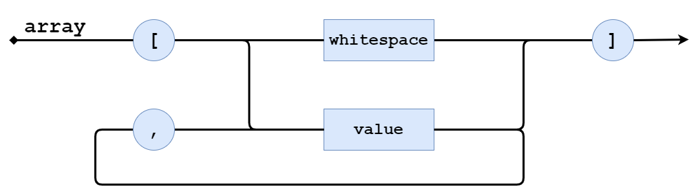
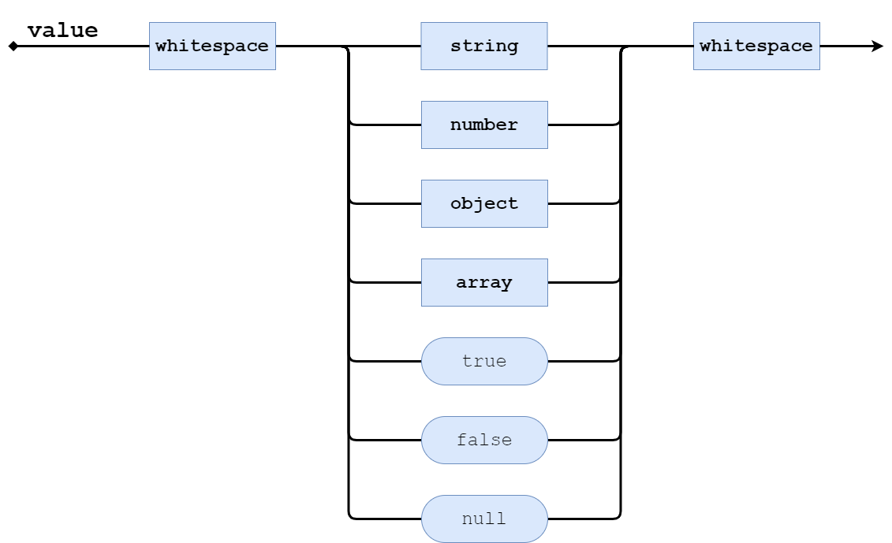
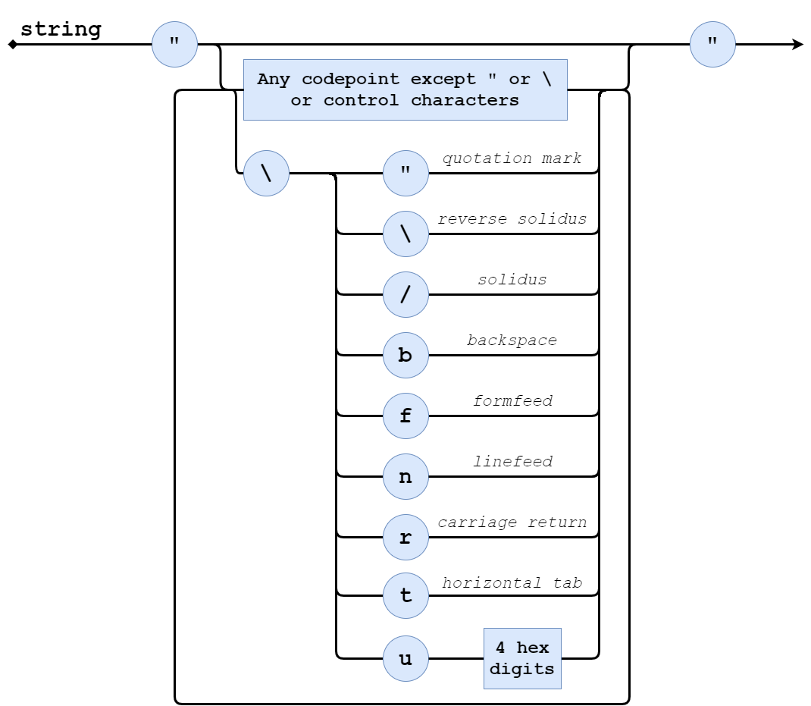
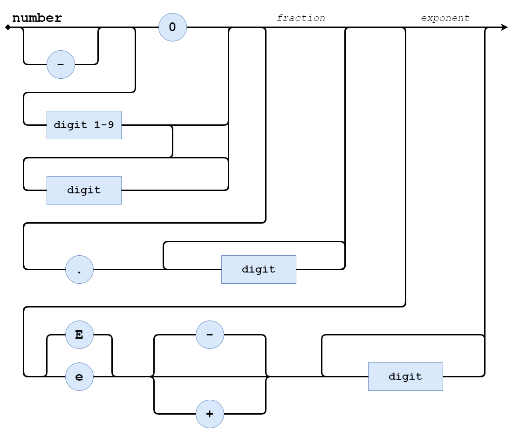
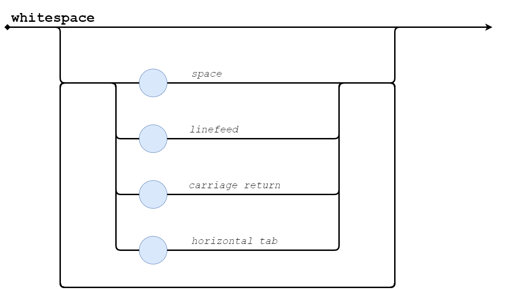

# GA2020: JSON to JSX

## Постановка задачи

Необходимо реализовать конвертер из JSON формата в JSX (язык React). JSON файлы, подаваемые на вход, генерируются с помощью 
"react-test-renderer". 

Данная библиотека используется для отрисовки компонентов React в переменную (без использования 
браузера и реальной отрисовки). В React Native данный подход используется при тестировании UI с помощью JEST. 
Основная идея заключается в том, чтобы сравнить "отрисованный" компонент с эталонным, записанным в файл. 
Однако в файле он записан на языке JSX, а отрисовка происходит в JSON. Подобнее 
[здесь](https://jestjs.io/docs/ru/tutorial-react-native).

Нам стало интересно, как сравниваются данные форматы и насколько сложно перевести один в другой.

## Подход к реализации

- Описать грамматику языка JSON
- Создать j4 файл с описанием грамматики
- Сгенерировать парсер с помощью библиотеки antlr
- Распарсить JSON файл и получить дерево
- Обойти дерево и сгенерировать JSX

## Установка

- `git clone ...`
- `pip3 install -r requirements.txt`

## Запуск

- `python3 main.py --input /path/to/json --output /path/to/output/file`
- В папке examples находится один простой и один сложный пример, чтобы посмотреть на работу программы

Примечание: установив PyСharm и плагин "ANTLR v4 grammar plugin", Вы можете сами сгенерировать содержимое папки "json_jsx".
Для этого:
- ПКМ на JSON.j4 -> "Configure ANTLR..."
- В параметрах укажите выходную папку и язык (Python3)
- ПКМ на JSON.j4 -> "Generate ANTLR Recognizer"

## Описание грамматики JSON
***Объект*** - это неупорядоченный набор пар ключ/значение.

***Массив*** - упорядоченная коллекция значений.

***Значение*** может быть *строкой* в двойных кавычках, *числом*, **true**, **false**, **null**, *объектом* или *массивом*. 
Эти структуры могут быть вложенными.

***Строка*** - коллекция нуля и больше символов Unicode, заключённая в двойные кавычки, используя обратную косую черту (\) в качестве символа экранирования.

***Число*** представляется также, как в C или Java, кроме того, что используется только десятичная система счисления.

***Пробелы*** могут использоваться между любыми лексемами.

## Пример работы программы

Вход: 
>
    {
        "type": "View",
        "props": {
            "style": {
                "alignItems": "center",
                "backgroundColor": "#F5FCFF",
                "flex": 1,
                "justifyContent": "center"
            }
        },
        "children": [
            {
                "type": "Text",
                "props": {
                    "style": {
                        "fontSize": 20,
                        "margin": 10,
                        "textAlign": "center"
                    }
                },
                "children": [
                    "Welcome to React Native!"
                ]
            },
            {
                "type": "Text",
                "props": {
                    "style": {
                        "color": "#333333",
                        "marginBottom": 5,
                        "textAlign": "center"
                    }
                },
                "children": [
                    "This is a React Native snapshot test."
                ]
            }
        ]
    }
    
Выход:

>
    <View
    style = {{
    alignItems: "center",
    backgroundColor: "#F5FCFF",
    flex: 1,
    justifyContent: "center",
    }}
    >
    
    <Text
    style = {{
    fontSize: 20,
    margin: 10,
    textAlign: "center",
    }}
    >
    Welcome to React Native!
    </Text>
    
    <Text
    style = {{
    color: "#333333",
    marginBottom: 5,
    textAlign: "center",
    }}
    >
    This is a React Native snapshot test.
    </Text>
    </View>

## Возможное развитие проекта

Встроить данное решение как плагин в WebStorm. С его помощью пользователь легко сможет увидеть, как будет выглядеть
компонент при отрисовке без необходимости самого запуска проекта в браузере.

Можно сделать свое UI тестирование наподобие JEST, но с более гибкими условиями сравнения с эталоном.
 